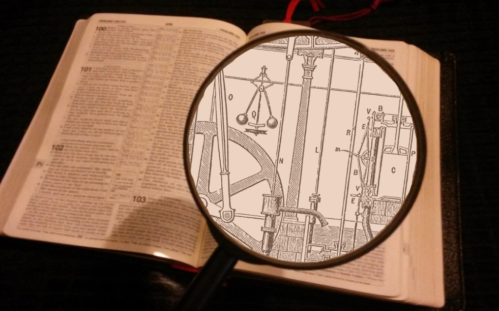

# A Brief History of Religious Transhumanism

## Objective(s)
- Summarize the history of religious transhumanism.
- Introduce the potential for religious transhumanism to mediate religious and secular conversations.

## Summary
Today most self-identified Transhumanists are **secular**, but transhumanist origins actually extend back to **religious Humanism `An integration of religious practices with ethics focused on human needs, interests, and abilities.`**. New Testament writers (notably Paul the Apostle) and centuries of early **Orthodox `The Orthodox Catholic Church or Eastern Orthodox Church.`** and **Catholic `The Roman Catholic Church.`** authorities **syncretized `To work to reconcile or synthesize different schools of thought.`** Christianity with the science of their day, which hearkened back to Plato and Aristotle. Throughout the following centuries, Christian **theologians `A person who studies the nature of god.`** continued preaching being one with Christ and becoming God. 

Over time, religious Humanism became increasingly concerned with technology. Nineteenth-century **Russian Orthodox** priest, Nikolai Fyodorov, taught that the common task of humanity should be the **technological resurrection `Using technology to revive deceased people.`** of our ancestors. And twentieth-century Jesuit priest, Pierre Teilhard de Chardin, advocated a vision of human evolution, accelerated by technology, where we merge with God.

Formal religious Transhumanist movements began in the early 21st century. Some founded new religions or complements to religion, such as the **Terasem Movement Transreligion `A nonprofit religious organization founded by Martine Rothblatt with four core beliefs: life is purposeful, death is optional, God is technological, and love is essential.`** and the **Turing Church `A minimalist, open, adaptable religion founded by Giulio Prisco to complement traditional religions.`**. The majority embraced transhumanist interpretations of traditional religions, including members of the Mormon and Christian Transhumanist Associations—the two largest religious transhumanist organizations today.

Religious transhumanists offer a way to understand religious ideas and transhumanist ideas through a lens that aims to synthesize, or reconcile them. An example of this is the term ‘Transfigurist’, which some religious transhumanists use to refer to themselves. “Transfigurist” or “transfigurism" means change in form to an elevated state—echoing a key aim of transhumanism. At the same time, it brings to mind sacred stories from many religious traditions, where people were physically transformed to an elevated state in response to a divine encounter. These religious traditions span from Hinduism and Judaism, to Buddhism and Christianity. 

Religious transhumanists work for better understanding of both religious and transhumanist ideas. They translate between religious and transhumanist audiences, cultivate language that both can understand and appreciate, and work to realize their shared aims. In this way, they carry on the rich tradition of Paul the Apostle, early Christian authorities, and early religious transhumanists.

## Discussion Questions
- What is your honest reaction to the idea of syncretizing, or bringing together religious and scientific ideas? 
- How might religious transhumanists help or hinder discussions between religious and secular audiences today?
- What are the criteria to be a religious transhumanist? Do you consider yourself a religious transhumanist? Why or why not?

## Call to Action
- Learn about a historical or contemporary religious transhumanist—in what sense is this person a religious transhumanist? (e.g., Nikolai Fyodorov, Pierre Teilhard de Chardin, Giulio Prisco, Lincoln Cannon, etc.)
- Learn about and consider joining a religious transhumanist organization.

## Resources for further study/engagement:
- Examples of transfigurism from diverse religious traditions:
  - the [Universal Form of Krishna](http://vedabase.com/en/bg/11) (Hinduism)
  - the [Radiant Face of Moses](http://www.biblegateway.com/passage/?search=Exodus+34%3A29-35&version=NIV) (Judaism)
  - the [Wakening of Gautama Buddha](http://www.accesstoinsight.org/tipitaka/dn/dn.16.1-6.vaji.html#para-4-47) (Buddhism)
  - the [Transfiguration of Jesus Christ](http://www.biblegateway.com/passage/?search=Mark%209:1-10&version=NIV) the [Rapture](http://www.biblegateway.com/passage/?search=1%20Corinthians%2015:45-55&version=NIV) (Christianity)
  - the [Translation of the Three Nephites](http://www.lds.org/scriptures/bofm/3-ne/28) and the [Day of Transfiguration](http://www.lds.org/scriptures/dc-testament/dc/63.20-21?lang=eng#19) (Mormonism)
- [Mormon Transhumanist Association](https://transfigurism.org)
- [Christian Transhumanist Association](https://www.christiantranshumanism.org)
- [Christian authorities teaching theosis](https://new-god-argument.com/support/christian-authorities-teach-theosis.html)
- Early religious transhumanists: [Nikolai Fyodorov](https://en.wikipedia.org/wiki/Nikolai_Fyodorovich_Fyodorov), and [Pierre Teilhard de Chardin](https://en.wikipedia.org/wiki/Pierre_Teilhard_de_Chardin) 
- How Christianity syncretized with [Plato](http://lincoln.metacannon.net/2016/01/christian-conflict-and-integration-with.html) and [Aristotle](http://lincoln.metacannon.net/2016/02/christian-conflict-and-integration-with.html).
- [God in the Machine: My Strange Journey into Transhumanism](https://www.theguardian.com/technology/2017/apr/18/god-in-the-machine-my-strange-journey-into-transhumanism) (An article from The Guardian including a history of religious transhumanism).
